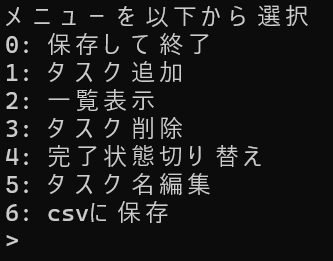
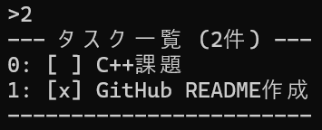

# ToDo_v2

## Overview

- C++で作成したCLI版ToDoアプリケーションです。
- タスクの追加・削除・編集・完了状態切り替えに対応しています。
- タスクはCSVファイルへ保存できます。

## Features

- タスク追加
- タスク削除
- タスク編集
- タスク完了切り替え
- タスク一覧表示
- csv保存 / 読み込み
- UTF-8対応

## Technologies

- C++
- Visual Studio
- Git
- GitHub
- CSV file I/O

## Project Structure

```text
ConsoleView
 └ 表示処理

CsvManager
 └ CSV保存 / 読み込み

InputHelper
 └ 入力補助・バリデーション

main
 └ アプリ起動・メニュー制御

Task
 └ タスクデータ

TaskHandlers
 └ メニュー操作処理

TaskManager
 └ タスク管理
```

## Design

### 主なクラス構成

`Task`
- 1件分のタスクデータを保持
- タスク名と完了状態を管理

`TaskManager`
- タスク一覧を管理
- 追加・削除・編集・完了切り替えを担当

`InputHelper`
- ユーザー入力を担当
- 数値入力やタスク名のバリデーションを実施

`ConsoleView`
- コンソール表示を担当
- メニュー・タスク一覧・成功/失敗メッセージを表示

`CsvManager`

- CSVファイルの読み込み・保存を担当

`TaskHandlers`
- アプリケーションの処理を担当
- 入力・タスク操作・表示をつなぐ役割

### 設計方針

- 責務を明確に分離する
- 重複コードを減らす
- 読みやすさを向上させる
- 将来的な機能追加をしやすくする

## Installation

### 1. リポジトリをクローン

```bash
git clone https://github.com/AIM-yamamori/ToDo_v2.git
cd ToDo_v2
```

### 2. Visual Studio で開く

`.slnx` ファイルを Visual Studio で開きます。

### 3. ビルド

Visual Studio の「ローカル Windows デバッガー」を実行してビルドします。

### 4. 実行

コンソール上でタスク管理アプリが起動します。

## How to Use

起動後、メニュー番号を入力して操作します。

### メニュー一覧

| 番号 | 内容 |
| --- | --- |
| 0 | 終了 |
| 1 | タスク追加 |
| 2 | タスク一覧表示 |
| 3 | タスク削除 |
| 4 | 完了状態切り替え |
| 5 | タスク名変更 |
| 6 | CSV保存 |

### 使用例

#### タスク追加

```text
追加するタスク名を入力> C++課題
```

#### タスク完了切り替え

```text
完了切り替えするタスクのindex番号を入力> 0
```

#### タスク編集

```text
編集するタスクのindex番号を入力> 0
新しいタスク名を入力> C++最終課題
```

### データ保存

タスクは CSV ファイルに保存されます。

アプリ終了時、またはメニュー `6` の保存機能で保存できます。


## Build

### 開発環境

- Visual Studio 2026
- C++20
- Windows

### ビルド方法

1. `.slnx` ファイルを Visual Studio で開く

2. ビルド構成を選択

```text
Debug または Release
```

3. 「ローカル Windows デバッガー」を実行

または、
```text
Ctrl + F5
```
でコンソールアプリを起動できます。

### 文字コード設定

コンソールで日本語を扱うため、UTF-8 を使用しています。

```cpp
SetConsoleOutputCP(65001);
SetConsoleCP(65001);
```

## Example

### メニュー表示

```text
メニューを以下から選択
0: 保存して終了
1: タスク追加
2: 一覧表示
3: タスク削除
4: 完了状態切り替え
5: タスク名編集
6: csvに保存
>
```

### タスク追加

```text
追加するタスク名を入力> GitHub README作成
[SUCCESS] 以下のタスクを追加しました
1: [ ] GitHub README作成
--- タスク一覧 (2件) ---
0: [ ] C++課題
1: [ ] GitHub README作成
------------------------
```

### タスク一覧

```text
--- タスク一覧 (2件) ---
0: [ ] C++課題
1: [ ] GitHub README作成
------------------------
```

### 完了状態切り替え

```text
完了切り替えするタスクのindex番号を入力> 0
[SUCCESS] 完了状態を以下に変更しました
0: [x] C++課題
--- タスク一覧 (2件) ---
0: [x] C++課題
1: [ ] GitHub README作成
------------------------
```

### タスク編集

```text
編集するタスクのindex番号を入力> 0
新しいタスク名を入力> 洗濯
[SUCCESS] 以下のタスク名に変更しました
0: [x] 洗濯
--- タスク一覧 (2件) ---
0: [x] 洗濯
1: [ ] GitHub README作成
------------------------
```

### タスク削除

```text
削除するindexを入力> 1
[SUCCESS] 削除しました
1: [ ] GitHub README作成
--- タスク一覧 (1件) ---
0: [x] 洗濯
------------------------
```

### CSV読み込み

```text
[SUCCESS] csvからタスクを読み込みました
--- タスク一覧 (1件) ---
0: [ ] 洗濯
------------------------
```

### CSV保存

```text
[SUCCESS] csvにタスクを保存しました
```

## 終了
```text
[SUCCESS] csvにタスクを保存しました
[SUCCESS] 終了します...
```

## Future Improvements

- タスク検索機能の追加
- タスク期限日の追加
- 優先度機能の追加
- タスク並び替え機能
- カテゴリ機能
- CSV以外の保存形式対応
- GUIアプリ化
- コードのさらなる責務分離
- 単体テストの追加
- 設定ファイル対応

## License

This project is licensed under the MIT License.

## Screenshots

### Menu



### Task List

